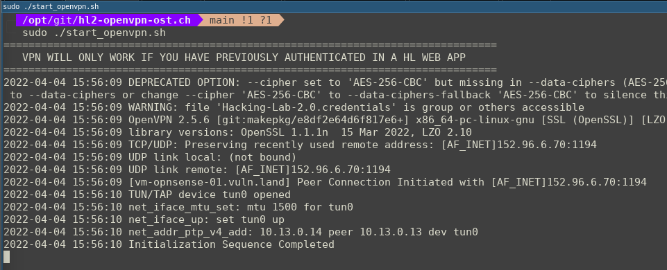

# Introduction
If you need a reverse-shell from one of the vulnerable Hacking-Lab services back to your local computer, you must connect to our vulnerable systems using OpenVPN. The vulnerable services are firewalled and therefore you cannot connect back to an internet ip address.

## VPN via GUI
https://youtu.be/ZJcj3bHJO0Q

## VPN via CLI
https://youtu.be/O3Nrc1j7VUg

## Pre-Requirement
Please be aware, you **MUST** be authenticated with your browser in one of the Hacking-Lab 2.0 applications, `before VPN access will be granted`!

## Kookarai Pentesting Linux
The VPN is pre-configured on the latest HL LiveCD. 
Get a copy from https://livecd.hacking-lab.com/ 

